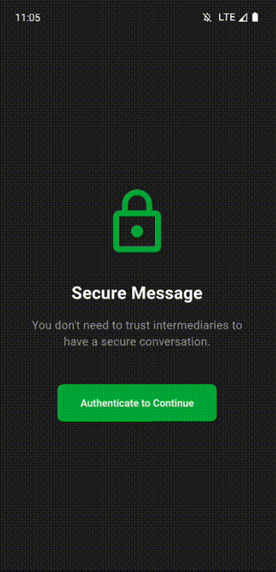

# Secure Message
- 

A secure messaging application built with Flutter that enables end-to-end encrypted communication. The app uses asymmetric encryption to ensure that messages can only be read by their intended recipients.

## Features

- **End-to-End Encryption**: Messages are encrypted using public-key cryptography, ensuring only intended recipients can decrypt them
- **Multiple Recipients**: Send encrypted messages to multiple recipients simultaneously
- **Key Management**: Generate and manage encryption keys within the app
- **Share Anywhere**: Share encrypted messages through any platform (messaging apps, email, etc.)
- **Secure Import**: Safely import and decrypt messages intended for you
- **Dark Theme**: Modern dark theme interface for comfortable usage
- **Internationalization**: Supports multiple languages

## How It Works

1. **Key Generation**: Users generate their public/private key pair within the app
2. **Message Creation**: Users can compose messages and select recipients from their stored contacts
3. **Encryption**: The message is encrypted separately for each recipient using their public keys
4. **Sharing**: The encrypted message can be shared through any platform
5. **Decryption**: Recipients can import the encrypted message and decrypt it using their private key

## Security Features

- Hybrid encryption system combining:
  - X25519 (curve25519) for secure key exchange
  - AES-GCM 256-bit for message encryption
- Private keys never leave the device
- Messages are encrypted individually for each recipient
- No central server or message storage
- Clean and secure key management

## Getting Started

### Prerequisites

- Flutter SDK
- Dart SDK
- Android Studio / Xcode (for mobile deployment)

### Installation

1. Clone the repository:
```bash
git clone https://github.com/yourusername/flutter_secure_message.git
```

2. Navigate to the project directory:
```bash
cd flutter_secure_message
```

3. Install dependencies:
```bash
flutter pub get
```

4. Run the app:
```bash
flutter run
```

## Usage

1. **First Launch**: Generate your encryption keys through the Keys page
2. **Send a Message**:
   - Tap the "New Message" button
   - Write your message
   - Select recipients
   - Share the encrypted message
3. **Receive a Message**:
   - Copy the encrypted message you received
   - Use the "Decrypt Message" feature
   - The app will automatically decrypt the message if you're an intended recipient

## Contributing

Contributions are welcome! Please feel free to submit a Pull Request.

## License

This project is licensed under the MIT License - see the LICENSE file for details.

## Security Notice

This app is designed for educational purposes and personal use. While it implements strong encryption practices, it has not undergone a formal security audit. Use at your own discretion.

## Acknowledgments

- Built with Flutter and GetX
- Uses asymmetric encryption for secure communication
- Implements modern UI/UX practices
